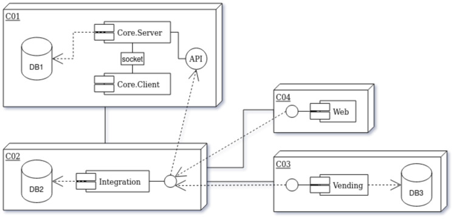

<h1 align="center"> </h1>
<h1 align="center">Caresoft</h1>
<h3 align="center">Sistema de Gestión y Automatización para Hospitales</h2>

Caresoft es un software integral diseñado para la gestión y automatización
eficiente de hospitales. Este README proporciona una visión general de la
estructura básica del proyecto, que consta de los siguientes componentes
principales:

## Estructura del Proyecto

1. **'caresoft_core'**
   - Este componente constituye el núcleo del software, encargado del backend
     para todas las operaciones de datos, incluyendo la creación, lectura,
     actualización y eliminación (CRUD). Además, gestiona la autorización de
     usuarios y roles. Proporciona una interfaz de conexión para la capa de
     integración.

2. **'caresoft_integration'**
   - La capa de integración actúa como el enlace entre el núcleo y otros
     componentes del sistema. Sus responsabilidades incluyen:
     - Exponer servicios de conexión para permitir que otros componentes
       realicen sus funciones.
     - Manejar interrupciones con el CORE al responder con sus propios balances
       y atender las solicitudes de los demás componentes.
     - Aplicar transacciones en el sistema central una vez restablecida la
       comunicación.
     - Registrar todas las peticiones y respuestas, y refrescar sus balances
       para mantenerlos actualizados en caso de una caída del sistema central.

3. **'caresoft_web'**
   - El frontend principal del sistema, que ofrece una interfaz de usuario
     orientada al cliente para interactuar con el software.

4. **'caresoft_vending'**
   - Este componente corresponde al sistema de gestión financiera, destinado a
     ser utilizado por usuarios cajeros. Sus funciones incluyen:
     - Soportar la entrada y salida de efectivo.
     - Iniciar el día con un monto inicial.
     - Realizar un cuadre al final del día luego de todas las transacciones
       realizadas.

Los demás directorios son:

1. **'caresoft_db' (Database)**
   - Directorio que contiene el modelo de base de datos del sistema. Aquí se
     encuentran todos los scripts y archivos relacionados con la estructura y
     configuración de la base de datos utilizada por el software.

2. **'caresoft_doc' (Documentation)**
   - Directorio que alberga toda la documentación del proyecto. Incluye
     especificaciones técnicas, diagramas, y cualquier otro documento relevante
     para comprender el funcionamiento del sistema.

Esta arquitectura se puede visualizar en el siguiente diagrama:

## Tecnologías Utilizadas

- **Framework:** [C# 12](https://learn.microsoft.com/en-us/dotnet/csharp/) & [.NET 8](https://dotnet.microsoft.com/en-us/).
- **Web Framework:** [Blazor](https://dotnet.microsoft.com/en-us/apps/aspnet/web-apps/blazor) & [ASP.NET](https://dotnet.microsoft.com/en-us/learn/aspnet/what-is-aspnet).
- **Database Engine:** [MySQL 8.0](https://www.mysql.com/).
- **Deployment:** [Docker](https://www.docker.com/) & [Ubuntu Server](https://ubuntu.com/download/server).
- **Logging:** [NLog](https://nlog-project.org/).

## Contribución

Para empezar a contribuir en el proyecto debes de hacer lo siguiente:

1. Configura tus claves SSH en los ajustes de tu perfil, genera una si no
   tienes una a disposición y agrégala a tu perfil.
2. Fork del repositorio (`git clone git@github.com:d4r1us-drk/Caresoft`)
3. Crea una nueva branch (`git checkout -b feature/nueva-funcionalidad`).
4. Realiza tus cambios y haz commit de ellos (`git commit -am 'Agrega una nueva
   funcionalidad'`).
5. Haz push a la branch (`git push origin feature/nueva-funcionalidad`).
6. Abre un Pull Request para evaluar tus cambios y hacer merge a la main
   branch.

## Licencia

Este proyecto está bajo la licencia [GPLv3](LICENSE).
